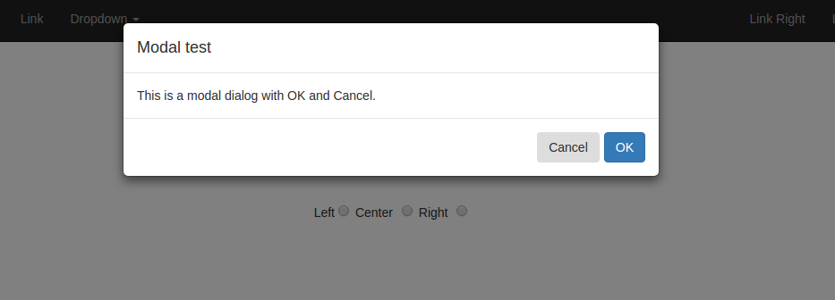

<style>
code {
    font-family: monospace;
} 
</style>

# EZReact Modals

EZReact Modals gives you the opporunity to use professional, modal dialogues in your ReactJS app.  What's nice about the EZReact Modal is the flexibility it gives you in providing any number of buttons and stlyings for each.  Since the text is provided at runtime, you can ensure I18N compatibility for your app.

The call to EZReact Modals uses an options object.  You basically provide an array of button objects and their respective stylings.  Also, you provide a callback where EZReact Modal will return control to you with the ID of th ebutton that was pressed.  Here's an example that creates an OK/Cancel modal.

```javascript
let buttonRow = [];
let cancelButton = {};
let okButton = {};

// Set up 2 buttons.. Cancel and OK
cancelButton.text = 'Cancel';
cancelButton.className = 'secondary';
cancelButton.id = 'cancelButton';
buttonRow.push(cancelButton);

okButton.text = 'OK';
okButton.className = 'primary';
okButton.id = 'okButton';
buttonRow.push(okButton);

let modalOptions = {
  message: 'This is a modal dialog with OK/Cancel',
  title: 'Modal test',
  buttonRow: buttonRow,
  position: this.state.position,
  callBack: this.modalCallback.bind(this)
}
// See below for this statement (setState)
this.setState({ modal: this.showModal(modalOptions) });
```

As you can see, first I create an array that will hold my button objects.  The button objects are simple.  They contain:

* text &#10230; The text that appears on the button
* className &#10230; The class of the buttons.  Since this is based on Bootstrap, Bootstrap classes are used.  
    * danger, 
    * success, 
    * info, and,
    * warning
* id &#10230; The ID to be attached the button. This is what is passed back to you on the callBack.

The modal options object is straightforward.  It contains:

* message &#10230; The message to be displayed.
* title &#10230; The message title
* buttonRow &#10230; The array of button objects
* position &#10230; One of 'left', 'center', or 'right'.  The example uses a state variable for this.  Check out the source to see how this is done.
* callBack &#10230; The function that receives control after a button is clicked.  It will be passed the id of the button that was clicked.


Here's an example of the callback.

```javascript
/**
 * 
 * @param {*} buttonId 
 */
modalCallback( buttonId ) {

    alert( 'You clicked button: ' + buttonId );   // Contains the ID of the button from the options object

}


callBack: this.modalCallback.bind(this)
```

## About setState

See here for a brief overview of ReactJS state.

### About this statement...

```javascript
this.setState({ modal: this.showModal(modalOptions) });
```

This is calling the method 'showModal' which is in the ezreact base class.  It is passed the options objects that we defined (the button array, callBack and so on).  It returns a React component -- and that has to go somewhere.  That 'somewhere' is stored in the apps 'state'.  But that's not enough, it also needs to be rendered.  All you have to do is include this statement in your render method.

* The ,code>setState</code> 'sets' an object with a key of 'modal'.  
* <code>this.state.modal</code> &#10230; 'retrieves' it.

```javascript
render() {

    return (

        . . . .
        {/* Hold our modal dialogue here */}
        {this.state.modal}  
        . . . .

    );
  }

```
# Screenshot

The above code will produce...




You can see the stylings of the buttons.  Primary for OK and secondary
