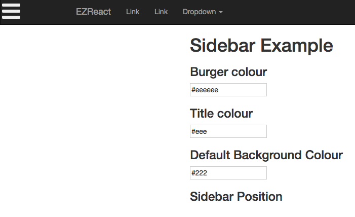
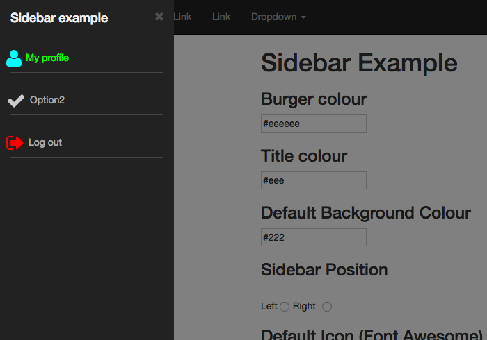
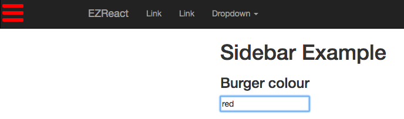
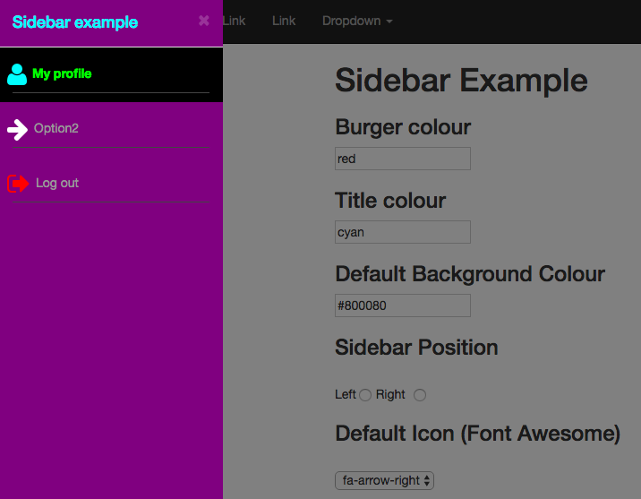
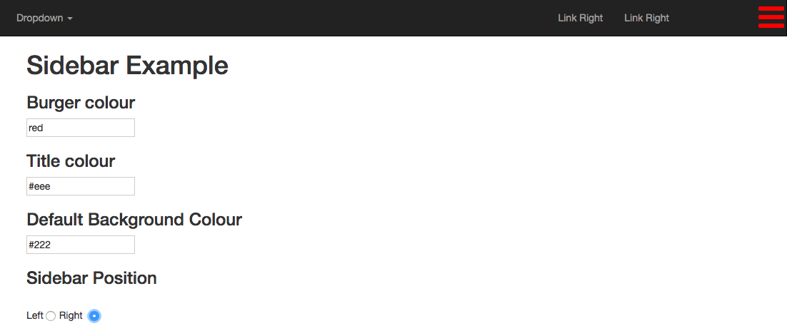

<style>
code {
    font-family: monospace;
} 
</style>

# EZReact Sidebar

EZReact Sidebar lets you define a slide in navigation pane (from the left or right) that is available from a 'burger menu'.  The items in the sidebar can be customised to include icons, various colours, and uniqeue ids in order that a callBack function can identify what has been clicked.

You can also add dividers after each item, colourize the entire background and default font colours. Here's screenshots from the example.



<hr size='1' />



One the best features of the EZSidebar component is the ability to customise how it looks.  A few changes to the options and... 

### New burger colour...



### Various changes to icons, colours...



### Switch to the right hand side


<hr size='1' />

So.. it's up to you how it looks.  Let's take a look at the options.  The sidebar accepts an options object.

This is taken from SidebarExample.jsx. 

```javascript
let options = {};
options.align = this.state.position;    // Left or Right.
options.burgerColor = this.state.burgerColour;
options.title = 'Sidebar example';
options.titleColor = this.state.titleColour;
options.showDividers = true;

options.items = [];
options.backgroundColor = this.state.backgroundColour;
options.color = this.state.defTextColour; // default text colour
options.icon = this.state.defIcon;  // default icon
options.iconColor = this.state.defIconColour; // default icon colour
options.callBack = this.sidebarCallBack;

let opt1Item = {}
opt1Item.text = 'My profile';
opt1Item.id = 'option1';
opt1Item.icon = 'fa fa-user fa-2x';
opt1Item.iconColor = 'cyan';
opt1Item.color = 'lime';
options.items.push(opt1Item);

let opt2Item = {}
opt2Item.text = 'Option2';
opt2Item.id = 'option2';
options.items.push(opt2Item);

let opt3Item = {}
opt3Item.text = 'Log out';
opt3Item.id = 'option3';
opt3Item.icon = 'fa fa-sign-out fa-2x';
opt3Item.iconColor = 'red';
options.items.push(opt3Item);

```

## Defaults

Defaults apply if an item does not have:
* An icon,
* The colour of the icon,
* The text colour

## Rendering the Sidebar

I always call a function to do this... simply makes your render code cleaner.  This is taken from SidebarExample.jsx.

sidebarCallback --> with the ID as a parm is called when the user clicks an item.  This function is set up in the options object.

Remember, EZSidebar is part of the EZReact 'package'. This call to 

```javascript 
this.showSidebar(options);
```

is in the EZReact base class.


```javascript
options.callBack = this.sidebarCallBack;
```
<hr size='1' />

```javascript

 sidebarCallback(id) {
    alert('You clicked this item: ' + id)
  }

 getSidebar() {
    let options = {};
 
    options.align = this.state.position;
    options.burgerColor = this.state.burgerColour;
    options.title = 'Sidebar example';
    options.titleColor = this.state.titleColour;
    options.showDividers = true;
    options.items = [];
    options.backgroundColor = this.state.backgroundColour;
    options.color = this.state.defTextColour; //  // default text colour
    options.icon = this.state.defIcon;  // default icon
    options.iconColor = this.state.defIconColour; // default icon colour
    options.callBack = this.sidebarCallBack;

    let opt1Item = {}
    // options for an item
    // text, text colour, FA Icon, Icon Colour, Unique id used in a callback
    opt1Item.text = 'My profile';
    opt1Item.id = 'option1';
    opt1Item.icon = 'fa fa-user fa-2x';
    opt1Item.iconColor = 'cyan';
    opt1Item.color = 'lime';
    options.items.push(opt1Item);

    let opt2Item = {}
    opt2Item.text = 'Option2';
    opt2Item.id = 'option2';
    options.items.push(opt2Item);

    let opt3Item = {}
    opt3Item.text = 'Log out';
    opt3Item.id = 'option3';
    opt3Item.icon = 'fa fa-sign-out fa-2x';
    opt3Item.iconColor = 'red';
    options.items.push(opt3Item);

    return this.showSidebar(options);
}

render() {
    return (
      <div>
        <Header />
        . . . . .
        . . . . .
        {this.getSideBar()}
        . . . . .
      </div>
```

Please take a look at the example code for the working example.


